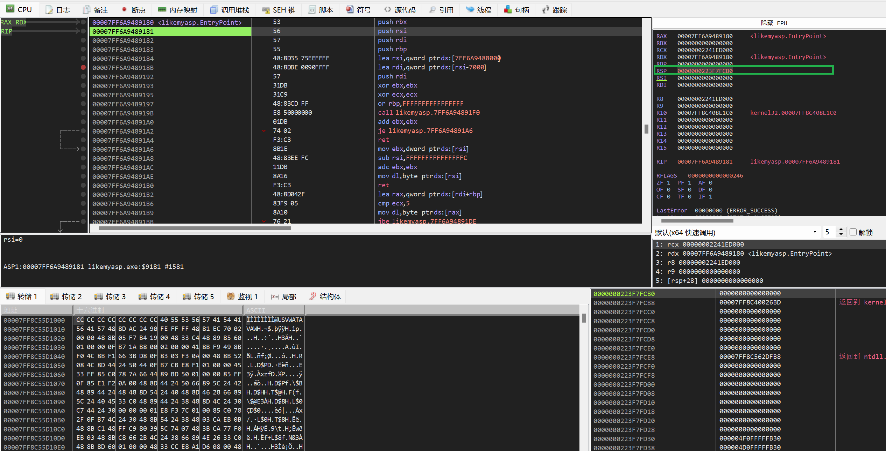

## Web

### Word-For-You

无``WAF``的``SQL``注入:填完留言表后点查询留言，发现``url``的形式是: ``comments.php?name=admin``, 尝试用``sqlmap``直接进行注入：

```sql
sqlmap -u 'url' --dbs #列出数据库名
sqlmap -u 'url' -D dbname --tables #列出表名
sqlmap -u 'url' -D dbname -T tablename --columns #列出表名
sqlmap =u 'url' -D dbname -T tablename -C 'id,name' --dump #列出字段的数据
```

## Reverse
### Pyre
exeinfo查看文件，64位可执执行程序。用IDA打开，在字符串窗口发下如下内容：

包含许多python的函数，因此这个可执行文件是用python来实现的。逆向的目标是:
$exe \rightarrow pyc \rightarrow py$
- exe可执行文件到pyc文件的转化：一般是通过PyInstaller制作的exe文件的，可以用``pyinstxtractor.py``提取出exe中的资源文件。将脚本文件和exe文件放到同一个目录下，执行如下的命令：
    ```bash
    python pyinstxtractor.py pyre.exe
    ```
则会在当前目录下生成提取后的资源文件。
- pyc文件到py文件的转化：从提取的资源文件中找到与可执行文件同名的pyc文件以及一个struct.pyc文件。用struct.pyc文件补全pyre.pyc文件的头

补全后的pyre.pyc文件（用struct.pyc的前11个字节覆盖pyre.pyc的前11个字节）

用uncompyle工具将pyc文件转位py文件
    ```shell
     uncompyle6 pyre.pyc > pyre.py
    ```
得到如下的python源代码文件
```python
# uncompyle6 version 3.8.0
# Python bytecode 3.6 (3379)
# Decompiled from: Python 3.10.6 (tags/v3.10.6:9c7b4bd, Aug  1 2022, 21:53:49) [MSC v.1932 64 bit (AMD64)]
# Embedded file name: pyre.py
# Compiled at: 1995-09-28 00:18:56
# Size of source mod 2**32: 272 bytes
flag = ''
encode = 'REla{PSF!!fg}!Y_SN_1_0U'
table = [7, 8, 1, 2, 4, 5, 13, 16, 20, 21, 0, 3, 22, 19, 6, 12, 11, 18, 9, 10, 15, 14, 17]

def enc(input):
    tmp = ''
    for i in range(len(input)):
        tmp += input[table[i]]

    return tmp


if __name__ == '__main__':
    print('Please input your flag:')
    flag = input()
    if len(flag) != 23:
        print('Length Wrong!!')
    else:
        final = enc(flag)
        if final == encode:
            print('Wow,you get the right flag!!')
        else:
            print('Sorry,Your input is Wrong')
# okay decompiling pyre.pyc
```
根据加密函数写解密的脚本：
```python
encode = 'REla{PSF!!fg}!Y_SN_1_0U'
table = [7, 8, 1, 2, 4, 5, 13, 16, 20, 21, 0, 3, 22, 19, 6, 12, 11, 18, 9, 10, 15, 14, 17]
flag=[0]*len(encode)
for i in range(len(encode)):
	flag[table[i]] = encode[i]
print("".join(flag))
```
### EasyRe
给了``easyre.exe``和``enc.dll``两个文件，反汇编二进制文件，分析程序的逻辑：需要输入一个flag,然后调用``enc.dll``中的加密函数对flag进行加密，结果需要等于一个已知的字符串final。那么就用IDA去看dll文件，encode代码如下：
```c
__int64 __fastcall encode_0(const char *a1, __int64 a2)
{
  int v3; // [rsp+24h] [rbp+4h]
  int v4; // [rsp+64h] [rbp+44h]
  int v5; // [rsp+84h] [rbp+64h]

  sub_1800112CB(&unk_180021001);
  v3 = j_strlen(a1);
  v4 = 0;
  v5 = 0;
  while ( v4 < v3 )
  {
    *(_BYTE *)(a2 + v5) = aAbcdefghijklmn[a1[v4] >> 2];
    *(_BYTE *)(a2 + v5 + 1) = aAbcdefghijklmn[((a1[v4 + 1] & 0xF0) >> 4) | (16 * (a1[v4] & 3))];
    *(_BYTE *)(a2 + v5 + 2) = aAbcdefghijklmn[((a1[v4 + 2] & 0xC0) >> 6) | (4 * (a1[v4 + 1] & 0xF))];
    *(_BYTE *)(a2 + v5 + 3) = aAbcdefghijklmn[a1[v4 + 2] & 0x3F];
    v4 += 3;
    v5 += 4;
  }
  if ( v3 % 3 == 1 )
  {
    *(_BYTE *)(a2 + v5 - 1) = 61;
    *(_BYTE *)(a2 + v5 - 2) = 61;
  }
  else if ( v3 % 3 == 2 )
  {
    *(_BYTE *)(a2 + v5 - 1) = 61;
  }
  return sub_18001132A(a2);
}
```
就是一个BASE64加密代码，返回的``sub_18001132A``的代码如下：
```c
const char *__fastcall sub_180011660(const char *a1)
{
  int i; // [rsp+24h] [rbp+4h]

  sub_1800112CB(&unk_180021001);
  for ( i = 0; i < j_strlen(a1); ++i )
    a1[i] ^= Str[i % j_strlen(Str)]; //str="Reverse"
  return a1;
}
```
解密思路就很清晰了：先将final串和Str按字符进行异或，然后将得到的结果base64解密即可。(final需要仔细看一下下标，final首先是将每个值置为0了的)
```python
import base64
final=[8,8,0xE,0xD,0x28,0x40,0x11,0x11,0x3C,0x2E,0x2B,0x1E ,0x3D ,0xF ,0,3 ,0x3B ,0x3D ,0x3C ,0x15 ,0x28,5,0x50,0x46,0x3F,0x2A,0x39,9,0x31,0x56,0x24,
0x1C,0x3F,0x24,0x50,0x3C ,0x2C ,0x25 ,0x23 ,0x4B]
Str = "Reverse"
tmp=[0] * len(final)
for i in range(len(final)):
	tmp[i] = final[i] ^ ord(Str[i % len(Str)])
print(tmp)
enc_flag = bytes(tmp)
print(base64.b64decode(enc_flag.decode()))
```
### 艾克体悟题
安卓逆向题目，首先让程序跑起来。打开模拟器，安装APK
```bash
adb install demo.apk
```
运行程序，提示需要打开另外的Activity:

用Jadx查看源代码, 需要打开FlagActivity这个活动，然后点击10000次按钮后才能得到flag。


一种思路是apk反编译后重新打包，将1w该成1次。步骤如下：
- 下载[apktool](https://ibotpeaches.github.io/Apktool/): 这个工具可以将apk进行反编译和重新打包。执行如下命令：
  ```bash
  java -jar apktool_2.7.0.jar d demo.apk -o new1
  ```
  在生成的文件夹中，修改smali/com/droidlearn/activity_travel/目录下找到FlagActivity$1.smali文件，将其中的0x2710(10000)修改位0x1即可。修改完后用如下命令重新打包：
  ```
  java -jar apktool_2.4.1.jar b new1 -o new2.apk
  ```
  直接安装会报错误，因为没有签名
  
- 签名操作：利用keytool进行前面，这个工具只要配置了JAVA环境就有。
  ```
  keytool -genkey -alias testalias -keyalg RSA -keysize 2048 -validity 36500 -keystore test.keystore
  ``` 
  需要输入口令和一些答案，最后输入y确定即可。
  生成成功后会在目录下创建test.keystore文件，keytool -list -v -keystore test.keystore查看详细信息，这里的别名(testalias)很重要。然后为apk签名即可：
  ```
  jarsigner -verbose -keystore test.keystore -storepass 123456 -signedjar flag.apk new2.apk testalias
  ```
  -keystore +签名文件，
  -sotrepass +签名口令密码,
  -signedjar后跟三个参数 分别是签名后的apk文件 需要签名的apk文件 签名的别名
  
接着就运行
卸载掉原来安装了的包（com.droidlearn.activity_travel）
```shell
adb devices //查看adb连接的设备
adb shell pm list packages //查看已安装的包名
adb uninstall packageName //卸载
```
安装上重打包的APK
```
adb install flag.apk
```

运行指定的Activity
```
adb shell //进入调试
am start -n 包名/包名.活动名
```
例如我们想要启动FlagActivity这个活动，输入：
```
am start -n com.droidlearn.activity_travel/com.droidlearn.activity_travel.FlagActivity
```
然后自需要点击1次就可以得到flag.


### ur_so_naive
仍然是一道安卓逆向的题目，将程序跑起来，要求输入密码，然后判断是否正确。用jadx打开查看源代码如下：

程序的逻辑是将输入的串加密后，判断是否与已知的字节数组相等。加密的库可以看到是在资源文件夹下的。于是我们的解题思路是：首先得到这个libencry.so的库，然后静态分析其中的加密代码，逆向出解密的代码。
- 用apktool进行反编译，得到apk的目录。用IDA打开lib目录下的arm64-v8a中的libencry动态连接库文件。
  ```
  java -jar apktool_2.7.0.jar d demo.apk -o new1
  ```
直接查看MainActivity_encry会由于没有识别导入JNIEnv结构体让IDA分析的比较乱，需要我们手动去修改一下函数的参数


选择``MainActivity_encry``的参数，按y进行修改，修改成如下的内容：
```
__int64 __fastcall Java_com_new_1star_1ctf_u_1naive_MainActivity_encry(JNIEnv *env, jstring *jstring, unsigned int size, void *a5)
```
这样IDA就能识别JDNI结构体，代码的可读性提高不少。

- 分析代码：
```c
__int64 __fastcall Java_com_new_1star_1ctf_u_1naive_MainActivity_encry(JNIEnv *env, jobject obj, jstring *jstring, unsigned int size, void *a5)
{
  const jbyte *input; // x21
  const char *key; // x23
  jbyteArray len; // x22
  __int64 v11; // x8
  unsigned int v12; // w11
  __int64 v13; // x13
  unsigned int v14; // w11
  jbyte v15; // w12
  jbyte v16; // w12
  jbyte v17; // w12
  bool v18; // zf

  input = (*env)->GetStringUTFChars(env, jstring, 0LL);// 输入的字符串
  key = (*env)->GetStringUTFChars(env, a5, 0LL);// 密钥key="FALL"
  len = (*env)->NewByteArray(env, size);
  if ( size )
  {
    v11 = 0LL;
    do
    {
      v12 = (unsigned __int8)input[v11];
      if ( size - 1LL == v11 )
        v13 = 0LL;
      else
        v13 = v11 + 1;
      input[v11] = ((unsigned __int8)input[v11] >> 1) & 0x7F | (input[v11] << 7);
      v14 = ((v12 >> 1) & 0xFFFF807F | ((unsigned __int8)v12 << 7)) ^ *(unsigned __int8 *)key;
      v15 = ((_BYTE)v14 << 6) | ((unsigned __int8)v14 >> 2);
      input[v11] = v15;
      v16 = (32 * (v15 ^ key[1])) | ((unsigned __int8)(v15 ^ key[1]) >> 3);
      input[v11] = v16;
      v17 = (16 * (v16 ^ key[2])) | ((unsigned __int8)(v16 ^ key[2]) >> 4);
      input[v11] = v17;
      LOBYTE(v14) = v17 ^ key[3];
      input[v11] = v14;
      v18 = size == v11 + 1;
      input[v11++] = v14 ^ input[v13];
    }
    while ( !v18 );
  }
  (*env)->SetByteArrayRegion(env, len, 0LL, size, input);
  return (__int64)len;
}
```
因为key和加密之后的enc都是可以在源代码中获得的，就可以直接用爆破的方式来求解输入，求解代码如下：
```cpp
//solve.cpp
#include <iostream>
#include <string>
#include <windows.h>
using namespace std;

#define lobyte(x)   (*((BYTE*)&(x)))   // low byte

void func(char* input,char* key,int size) {
    __int64 index; // x8
    unsigned int v12; // w11
    __int64 v13; // x13
    unsigned int v14; // w11
    bool v18; // zf
    unsigned int v15, v16, v17;

    index = 0LL;
    do
    {
        v12 = (unsigned __int8)input[index];
        if (size - 1LL == index)
            v13 = 0LL;
        else
            v13 = index + 1;
        input[index] = ((unsigned __int8)input[index] >> 1) & 0x7F | (input[index] << 7);
        v14 = ((v12 >> 1) & 0xFFFF807F | ((unsigned __int8)v12 << 7)) ^ *(unsigned __int8*)key;
        v15 = ((BYTE)v14 << 6) | ((unsigned __int8)v14 >> 2);
        input[index] = v15;
        v16 = (32 * (v15 ^ key[1])) | ((unsigned __int8)(v15 ^ key[1]) >> 3);
        input[index] = v16;
        v17 = (16 * (v16 ^ key[2])) | ((unsigned __int8)(v16 ^ key[2]) >> 4);
        input[index] = v17;
        lobyte(v14) = v17 ^ key[3];
        input[index] = v14;
        v18 = size == index + 1;
        input[index++] = v14 ^ input[v13];
    } while (!v18);
}

int main() {
	char enc[] = { -36, 83, 22, -117, -103, -14, 8, 19, -47, 47, -110, 71, 2, -21, -52, -36, 24, -121, 87, -114, -121, 27, -113, -86 };
    int len = 24;
    char flag[25] = { 0 };
    char key[] = "FALL";
    flag[0] = 'f';
    flag[1] = 'l';
    char tmp[25] = { 0 };

    for (int i = 2; i < 24; i++) {
        for (int j = 0; i < 256; j++) {
            strcpy(tmp, flag);
            tmp[i] = j;
            func(tmp, key, len);
            if (tmp[i - 1] == enc[i - 1]) {
                flag[i] = j;
                break;
            }
        }
    }
    cout << flag;
}
```


### Likemyasp
本题需要用x64dbg手动脱ASP壳，关键是要找到OEP（origin entry point）:程序原始入口点。
>EP(Entry Point)，意即程序的入口点。而OEP是程序的原始入口点，一个正常的程序只有EP，只有入口点被修改的程序(加壳等)，才会拥有OEP。
OEP：(Original Entry Point)，程序的原始入口点，软件加壳就是隐藏了EP， 只要我们找到程序的OEP，就可以立刻脱壳。 PUSHAD （压栈） 代表程序的入口点
POPAD （出栈） 代表程序的出口点，与PUSHAD相对应，一般找到这个OEP就在附近。
脱壳过程：

1. 用X64DBG载入程序，按``F9``让程序执行到EntryPoint的地方。

2. 按``F8``，发现只有RSP寄存器的发生变化，符合ESP脱壳定律

3. 在寄存器窗口，点击RSP的值然后右键 => 在转储中跟随 

4. 可以看到在左下方内存窗口有用红色下划线标记的值，在内存窗口右键 => 断点 => 硬件，存取 => 四字节

5. 下好硬件断点后，按F9运行到断点处，发现程序停在了几个连续的POP后面
 
6. 可以看到下面有一个jmp的大跳指令，在这个地方下个断点，然后按``F9``运行到断点处，接着按``F7``单步步入。

7. 将要执行的是``sub rsp,28``,接下来就可以dump了
 
8. 点击菜单栏Scylla按钮, 选择转储即可


用IDA打开dump得到的可执行程序，可以在Main中看到程序逻辑：
```c
int __cdecl main(int argc, const char **argv, const char **envp)
{
  __int64 *v3; // rdx
  __int64 v4; // r8
  int i; // [rsp+20h] [rbp-158h]
  int j; // [rsp+28h] [rbp-150h]
  __int64 v8[30]; // [rsp+50h] [rbp-128h]
  char v9[32]; // [rsp+140h] [rbp-38h] BYREF

  sub_7FF6A9481070(qword_7FF6A9483240, argv, envp);
  sub_7FF6A9481140(&qword_7FF6A9483250, v9, 30i64);
  for ( i = 0; i < 24; i += 4 )
  {
    v3 = ((i >> 31) & 3);
    v8[i / 4] = ~v9[i + 3] | ((v9[i + 2] ^ 0x1Ei64) << 14) | ((v9[i + 1] ^ 0x14i64) << 23) | ((v9[i] ^ 0xAi64) << 37);
  }
  for ( j = 0; j < 6; ++j )
  {
    v3 = qword_7FF6A9484038;
    if ( v8[j] != qword_7FF6A9484038[j] )
    {
      sub_7FF6A9481070(qword_7FF6A9483258, qword_7FF6A9484038, v4);
      return 0;
    }
  }
  sub_7FF6A9481070(qword_7FF6A9483268, v3, v4);
  return 0;
}
```
解密脚本
```cpp
#include <iostream>
#include <string>
#include <windows.h>
using namespace std;

int main() {
	__int64 enc[6] = { 0xD803C1FC098,0x0E20360BC097,0x0FE02A1C00A0,0x0FA0121040CB,0x0F2032104092,0x0D6015884082 };
	for (int i = 0; i < 6; i++) {
		cout << (char)(((enc[i] >> 37) ^ 0xa) % 256);
		cout << (char)(((enc[i] >> 23) ^ 0x14) % 256);
		cout << (char)(((enc[i] >> 14) ^ 0x1E) % 256);
		cout << ((unsigned char)(~enc[i]));
	}
}
```

### EzTea
IDA查看程序的源代码，发现加密函数如下，根据特征可以判断这是XXTEA加密。从Wiki上找到标准的XXTEA加解密的代码如下：
```c
  #define DELTA 0x9e3779b9
  #define MX ((z>>5^y<<2) + (y>>3^z<<4) ^ (sum^y) + (k[p&3^e]^z))
  
  long btea(long* v, long n, long* k) {
    unsigned long z=v[n-1], y=v[0], sum=0, e, DELTA=0x9e3779b9;
    long p, q ;
    if (n > 1) {          /* Coding Part */
      q = 6 + 52/n;
      while (q-- > 0) {
        sum += DELTA;
        e = (sum >> 2) & 3;
        for (p=0; p<n-1; p++) y = v[p+1], z = v[p] += MX;
        y = v[0];
        z = v[n-1] += MX;
      }
      return 0 ; 
    } else if (n < -1) {  /* Decoding Part */
      n = -n;
      q = 6 + 52/n;
      sum = q*DELTA ;
      while (sum != 0) {
        e = (sum >> 2) & 3;
        for (p=n-1; p>0; p--) z = v[p-1], y = v[p] -= MX;
        z = v[n-1];
        y = v[0] -= MX;
        sum -= DELTA;
      }
      return 0;
    }
    return 1;
  }
```
修改一下IDA反编译后的源码（按``n``修改变量名，按``y``修改函数参数类型），方便和标准的XXTEA进行对比:

需要修改的地方
```c
// 以下是修改後：
#define DELTA 0x11451400
#define MX (((z>>4^y<<2) + (y>>3^z<<5)) ^ ((sum^y) + (key[(p&3)^e] ^ z)))
```

解密代码：
```cpp
#include <stdio.h>  
#include <stdint.h>  
#include <iostream>
using namespace std;

#define DELTA 0x11451400
#define MX (((z>>4^y<<2) + (y>>3^z<<5)) ^ ((sum^y) + (key[(p&3)^e] ^ z)))  

void xxtea(uint32_t* v, int n, uint32_t const key[4])
{
    uint32_t y, z, sum;
    unsigned p, rounds, e;
    if (n > 1)            /* Coding Part */
    {
        rounds = 6 + 52 / n;
        sum = 0;
        z = v[n - 1];
        do
        {
            sum += DELTA;
            e = (sum >> 2) & 3;
            for (p = 0; p < n - 1; p++)
            {
                y = v[p + 1];
                z = v[p] += MX;
            }
            y = v[0];
            z = v[n - 1] += MX;
        } while (--rounds);
    }
    else if (n < -1)      /* Decoding Part */
    {
        n = -n;
        rounds = 6 + 52 / n;
        sum = rounds * DELTA;
        y = v[0];
        do
        {
            e = (sum >> 2) & 3;
            for (p = n - 1; p > 0; p--)
            {
                z = v[p - 1];
                y = v[p] -= MX;
            }
            z = v[n - 1];
            y = v[0] -= MX;
            sum -= DELTA;
        } while (--rounds);
    }
}

int main() {
    unsigned char enc[] =
    {
      0x82, 0x8A, 0xFA, 0x38, 0x80, 0x13, 0x50, 0xD7, 0x9D, 0x96,
      0x40, 0x0E, 0x20, 0x91, 0x16, 0x4E, 0xAB, 0x29, 0x3A, 0x71,
      0x3D, 0x39, 0xE5, 0x6C, 0x2E, 0x75, 0x9D, 0xB6, 0xE6, 0x88,
      0x1A, 0x84, 0x59, 0xB4, 0x31, 0x6F, 0x00, 0x00, 0x00, 0x00
    };

    uint32_t key[] = { 0x19,0x19,0x8,0x10 };
		// 傳入-9代表解密
    xxtea((uint32_t*)enc, -9, (uint32_t*)key);

    cout << enc << endl;
    return 0;
}
```
### Annngrr
考察用Angr进行符号执行，用IDA载入原程序。分析程序逻辑：输入一个字符串，然后对每个字符做了变化，最后判断是否与已知的字符串相等，典型的输入既是flag的题目。思路就是将输入的flag符号化，然后等程序执行到要判断的地方进行约束求解。
- 首先从程序中提取已知的字符串的每个字符的ASCII码，可以通过ida中的python脚本来提取
  ```python
    startAddr = 0x140005038
    for i in range(32):
    print(Byte(startAddr+i),end=",")
  ```
- 接着利用Angr进行求解
  ```python
  import angr
  import claripy
  data=[79,23,12,86,219,103,93,103,50,43,54,3,2,243,161,228,199,39,193,182,76,215,89,161,113,82,154,226,33,150,12,202] #已知的串的ASCII
  bin_path = "Annnnnggrr.exe"
  p = angr.Project(bin_path)
  start_addr = 0x140001103 #跳过scanf，之后手工对某地址的数据进行符号化
  init_state = p.factory.blank_state(addr=start_addr)
  password = claripy.BVS("password",32*8) #flag的长度
  password_addr = 0x140005640 #从源代码中memcmp指令得到输入的字符串存放的地址
  init_state.memory.store(password_addr,password) #相当于声明变量

  sm = p.factory.simulation_manager(init_state)
  sm.explore(find=0x14000248A) #0x14000248A是memcp前一条指令，当执行完这条指令后 sm.found = true
  if sm.found:
	  check_state = sm.found[0]
	  for i in range(32):
		  #检测password中的每一个字符
		  ch = check_state.memory.load(password_addr+i,1)
		  check_state.solver.add(ch == data[i]) #添加约束
	  sol = check_state.solver.eval(password,cast_to=bytes) #进行求解
	  print(f'solution: {sol}')
  else:
	  print("no solution")
  ```


## Pwn
### ret2shellcode


## Crypto
### ezRabin
查看题目内容：
```python
from Crypto.Util.number import *
from somewhere_you_do_not_know import flag
#flag格式为 flag{XXXX}
def ezprime(n):
    p=getPrime(n)
    while p%4!=3:
        p=getPrime(n)
    return p
p=ezprime(512)
q=ezprime(512)
n=p*q
m=bytes_to_long(flag)
m=(m<<(300))+getRandomNBitInteger(300)
assert m**2>n and m<n
c=pow(m,4,n)
print('c=',c)
print('p=',p)
print('q=',q)
'''
c= 59087040011818617875466940950576089096932769518087477304162753047334728508009365510335057824251636964132317478310267427589970177277870220660958570994888152191522928881774614096675980017700457666192609573774572571582962861504174396725705862549311100229145101667835438230371282904888448863223898642183925834109
p= 10522889477508921233145726452630168129218487981917965097647277937267556441871668611904567713868254050044587941828674788953975031679913879970887998582514571
q= 11287822338267163056031463255265099337492571870189068887689824393221951058498526362126606231275830844407608185240702408947800715624427717739233431252556379
就要花里胡哨（
'''
```
这道题考察的是Rabin加密，和RSA有相似之处，但是也有很大的不同。Rabin中e取固定值e=2,p和q都是模4余3的素数。本题e=4只要依据e=2稍作修改，将4次方看做平方外再套一层平方即可，也就是进行两次e=2时的解密，一共得到4*4=16个解，再右移30位后从中找到flag即可。
```python
import gmpy2
from Crypto.Util.number import *

p=10522889477508921233145726452630168129218487981917965097647277937267556441871668611904567713868254050044587941828674788953975031679913879970887998582514571
q=11287822338267163056031463255265099337492571870189068887689824393221951058498526362126606231275830844407608185240702408947800715624427717739233431252556379
n=p*q
e=2
c=59087040011818617875466940950576089096932769518087477304162753047334728508009365510335057824251636964132317478310267427589970177277870220660958570994888152191522928881774614096675980017700457666192609573774572571582962861504174396725705862549311100229145101667835438230371282904888448863223898642183925834109
inv_p = gmpy2.invert(p, q)
inv_q = gmpy2.invert(q, p)

def de_rabin(c):
    mp = pow(c, (p+1) // 4, p)
    mq = pow(c, (q+1) // 4, q)
    a = (inv_p * p * mq + inv_q * q * mp) % n
    b = n-int(a)
    c = (inv_p * p * mq - inv_q * q * mp) % n
    d = n-int(c)
    return a,b,c,d

'''e=4的解密，就是做两次e=2的rabin解密，
第一次得到4个解，将4个解作为新的c分别再做一次e=2的rabin解密,
所以共得到16个解，右移300位后看看哪个解是flag'''

a,b,c,d=de_rabin(c)
a1,a2,a3,a4=de_rabin(a)
b1,b2,b3,b4=de_rabin(b)
c1,c2,c3,c4=de_rabin(c)
d1,d2,d3,d4=de_rabin(d)

l=[a1,a2,a3,a4,b1,b2,b3,b4,c1,c2,c3,c4,d1,d2,d3,d4]
for ll in l:
    print(long_to_bytes(ll>>300))
```

## Misc


## BlockChain

